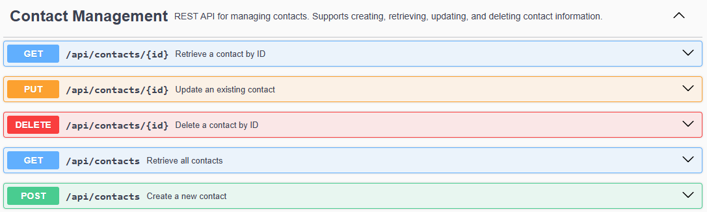

# Contact Management API

A RESTful API built with Java and Spring Boot for managing contacts.

This project was created as part of my journey to become a Java/Spring Boot Backend Developer. The goal is to learn and apply backend development concepts such as layered architecture, REST APIs, data validation, exception handling, and database integration.

## Features

* Create contacts
* Retrieve all contacts
* Retrieve a contact by ID
* Update contacts
* Delete contacts
* Request validation
* Business rule validation
* Global exception handling
* Swagger/OpenAPI documentation

## Technologies Used

* Java 25
* Spring Boot 4
* Spring Data JPA
* Hibernate
* MySQL
* Maven
* Swagger/OpenAPI
* Postman

## Architecture

The application follows a layered architecture:

```text
Controller
    ↓
Service
    ↓
Repository
    ↓
Database
```

### Project Structure

```text
src/main/java
│
├── controller
├── service
├── repository
├── entity
├── dto
├── mapper
├── exception
└── config
```

## API Endpoints

| Method | Endpoint           | Description                |
| ------ | ------------------ | -------------------------- |
| GET    | /api/contacts      | Retrieve all contacts      |
| GET    | /api/contacts/{id} | Retrieve a contact by ID   |
| POST   | /api/contacts      | Create a new contact       |
| PUT    | /api/contacts/{id} | Update an existing contact |
| DELETE | /api/contacts/{id} | Delete a contact           |

## Validation

The API validates incoming requests using Bean Validation.

Examples:

* First name is required
* Last name is required
* Email must have a valid format
* Birth date must be in the past

## Business Rules

The application enforces business rules such as:

* Email addresses must be unique
* Duplicate emails are rejected with HTTP 409 Conflict

## Exception Handling

Custom exception handling is implemented using:

* GlobalExceptionHandler
* ContactNotFoundException
* EmailAlreadyExistsException
* ValidationErrorResponse

## API Documentation

Swagger/OpenAPI documentation is available when the application is running:

```text
http://localhost:8080/swagger-ui/index.html
```


## Database Configuration

Update the database settings in:

```properties
src/main/resources/application.properties
```

Example:

```properties
spring.datasource.url=jdbc:mysql://localhost:3306/contact_management
spring.datasource.username=username
spring.datasource.password=password
```

## Running the Project

Clone the repository:

```bash
git clone https://github.com/FreddyAndresA/contact-management.git
```

Navigate to the project:

```bash
cd contact-management
```

Run the application:

```bash
mvn spring-boot:run
```

## Author

Freddy Angel

Java & Spring Boot Backend Developer.

Feedback and suggestions are always welcome.
